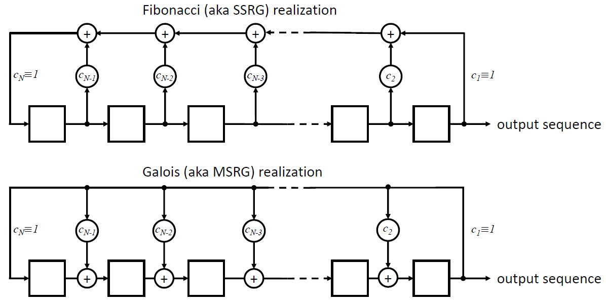

Explore Fibonacci, Galois, and State Space Linear Feedback Shift Register sequence generators.

# What is it?
LFSR-Lab is a collection of utilities for generating, manipulating, and analyzing Linear Feedback Shift Register sequences.

In this repository you'll find:
* Python, MATLAB, and C++ implementations of all utilities
* Customizable sequence generators for Fibonacci (aka SSRG), Galois (aka MSRG), and State Space (aka SSG) LFSR formulations
* Utilities to convert between equivalent SSRG and MSRG structures
* Utilities to calculate and apply masks to shift the starting position of the pseudorandom sequence 
* Utilities to perform fast propagation of LFSR state
# Requires
* Python
    * Python 2.7 or 3.x (x>5)
    * mabplotlib
    * scipy
    * numpy
* MATLAB
    * MATLAB version 8 or newer (no toolboxes needed)
    * GNU Octave version 4.0.0 or newer (no packages needed)
* C++
    * C++11 or newer
    * Self contained, no external dependencies (only standard library functions used)
# Functions
* ssrg() - Generate sequences using Fibonacci formulation
* msrg() - Generate sequences using Galois formulation
* ssrg_mask() - Masked Fibonacci generator
* msrg_mask() - Masked Galois generator
* ssrg2msrg() - Convert Fibonacci to equivalent Galois LFSR
* msrg2ssrg() - Convert Galois to equivalent Fibonacci LFSR
* ssgs_jump() - Fast forward/backward Fibonacci state propagation
* ssgm_jump() -Fast forward/backward Galois state propagation 
* jump2mask() - Convert a sequence jump to a Fibonacci mask
* msrg_jump2mask() - Convert a sequence jump to a Galois mask
# Compatibility
* Python code compatible with Python 2.7 and >= 3.6
* MATLAB code compatible with MATLAB version 8 (R2012b) or newer
* MATLAB code also compatible with GNU Octave version 4.0.0 or newer
* C++ code compatible with C++11 or newer

> Written with [StackEdit](https://stackedit.io/).
